<p align="center">
  
</p>

An Omarchy bar widget for keeping an eye on memory: see at a glance when
you're running low, find what's using it, and kill it in two clicks.

## At a glance

The bar item is a small ramen bowl: the broth level is memory used, the
colour follows your theme's green / yellow / red, and steam rises when memory
is tight (one wisp) or critical (two).

<table>
  <tr>
    <th>🟢 Healthy</th>
    <th>🟡 Tight</th>
    <th>🔴 Critical</th>
    <th>Light theme</th>
  </tr>
  <tr>
    <td align="center">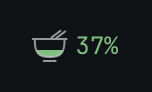</td>
    <td align="center">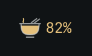</td>
    <td align="center">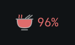</td>
    <td align="center">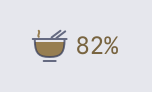</td>
  </tr>
</table>

<table>
  <tr><th>Memory</th><th>History</th></tr>
  <tr>
    <td valign="top">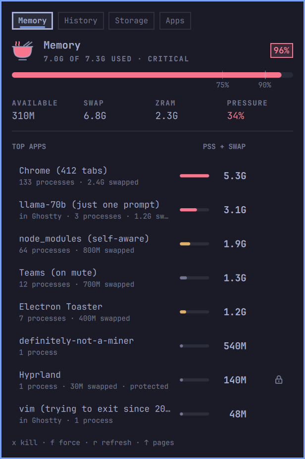</td>
    <td valign="top">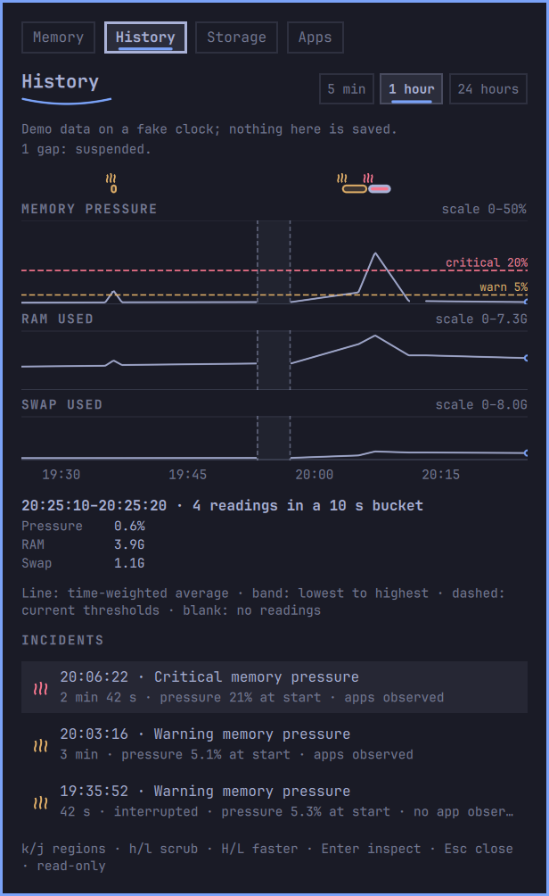</td>
  </tr>
  <tr><th>Storage</th><th>Apps</th></tr>
  <tr>
    <td valign="top">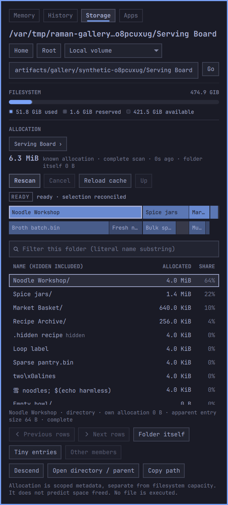</td>
    <td valign="top">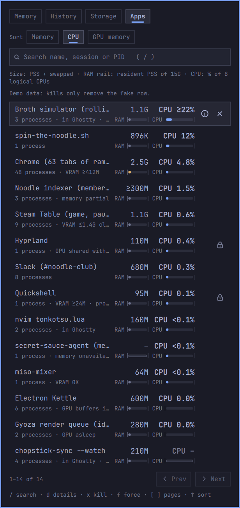</td>
  </tr>
  <tr><th>Apps details (offscreen)</th><th>Light theme (offscreen)</th></tr>
  <tr>
    <td valign="top">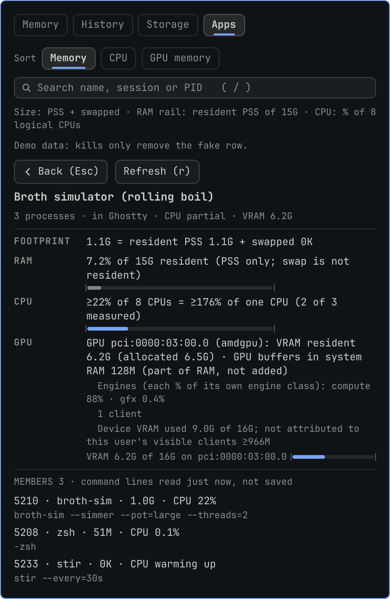</td>
    <td valign="top">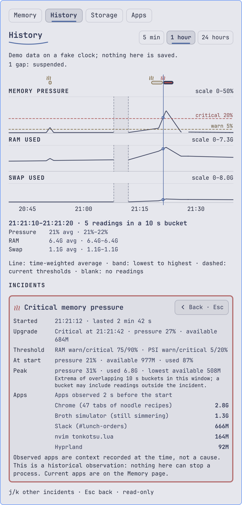</td>
  </tr>
</table>

<sub>The first four panels are <b>genuine native Omarchy captures</b> at 160%
in Tokyo Night: built-in synthetic Memory/History/Apps scenes and an original
Storage fixture with real filesystem measurements.
[Gallery and provenance](docs/screenshots/final-qa/README.md).
The bar previews and final table row remain <b>Qt 6.8 offscreen renders</b>,
not native screenshots ([method](docs/previews/README.md)).
The [verification summary](docs/qa/final-qa-evidence.md) describes measured
coverage and remaining limits.
[H3 captures](docs/qa/h3-omarchy-evidence.md) remain historical.</sub>

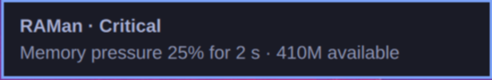

<sub>The notification is a native H3 capture: synthetic live input and the
real desktop notification helper; demo mode never sends notifications.
It predates the name's spelling fix, so its title reads "RAMan · Critical";
current builds send "RAMen · Critical". The capture is kept unretouched as
evidence. [Native masters and provenance](docs/media/masters/provenance.json).</sub>

## What you get

- **Bar:** a small ramen bowl whose broth level is memory used, plus `%`
  used, colored green / yellow / red, with steam when tight or critical.
  The color goes up when used memory crosses a threshold (75% / 90%) or when
  kernel memory pressure (PSI `some avg10`, the share of time tasks stalled
  waiting on memory, which is what you feel as hitching) crosses 5% / 20%.
  It drops back a level only once you're 3 points below the threshold, so it
  doesn't flicker. Hover for details, middle-click to refresh.
- **Panel (click):** used / available / swap / zram / pressure, then the
  heaviest apps. Sizes are RAM (PSS) + swapped. Each app's processes are
  grouped by its systemd app scope, so Chrome's 50 processes are one row.
  Terminals are split per shell session (`claude` in Ghostty is its own row).
  If the memory of some of an app's processes can't be read (a process can
  block it, as `ssh-agent` does), the row says *memory partial* and its size
  is a lower bound (`≥`).
- **History page:** 5 minutes, 1 hour or 24 hours of pressure, RAM and swap on
  separate scales, with one cursor. Lines show time-weighted averages and bands
  show bucket ranges; the 5-minute view shows individual readings. Missing
  readings and downtime stay blank. Stored incidents can be inspected without
  signalling any process. Sustained incidents are recorded after a configurable
  hold, can upgrade once to critical, and end at recovery or interrupted
  observation. Desktop alerts are opt-in and off by default.
- **Storage page:** one filesystem's used / reserved / available capacity, and
  separately what a folder you choose actually allocates, as proportional
  folder bands over a size ledger. Scans happen only when you press Scan, can
  be cancelled, and are cached privately for browsing. Open a folder or copy a
  path; nothing is ever deleted. See [Storage](#storage).
- **Apps page:** every app group, not just the top memory users, ranked by
  memory or recent CPU. Each row shows its size (PSS + swapped) and its share
  of the whole machine's CPU, with two slim rails: resident RAM against
  physical RAM and CPU against all CPUs. Search by name, session or PID, page
  through 50 at a time, open one app's details (its largest processes and
  their full command lines, read fresh when you ask and never saved), and
  kill with the same two steps as Memory. With a supported GPU, rank by GPU
  memory too. See [Apps](#apps).

## Page navigation

Use the Memory / History / Storage / Apps buttons. With the keyboard, `k` / Up from the top of
the Memory list focuses the page buttons; `h` / `l` or Left / Right then
selects a page. On History, `j` / `k` or Down / Up moves between page buttons,
time windows, chart and incidents. Horizontal keys change windows only while
the window controls are focused, and scrub readings only while the chart is
focused. `H` / `L` moves 12 readings at a time. Incident rows use `j` / `k`,
Enter inspects, and Esc returns to the list, then closes the panel.
Storage keys are listed under [Storage](#storage), Apps keys under [Apps](#apps).
Tab / Shift+Tab continues switching Omarchy bar panels. Kill keys only work in
the Memory and Apps app lists. Open a page through Omarchy's panel routing with:

```bash
omarchy-shell boundsj.raman page history   # or: page memory, page storage, page apps
```

With no RAMen panel open, Omarchy opens it on the focused monitor. The tested
Omarchy 4.0.4 host reuses an already-open copy, even on another monitor; close
that panel before opening on a different output. This host allows one popup
at a time across its bars.

## Killing

Two steps, so a stray click can't take out Chrome:

| Action                         | Mouse                       | Keyboard  |
| ------------------------------ | --------------------------- | --------- |
| Move                           | hover                       | `j` / `k` |
| Arm kill (SIGTERM)             | click ×                     | `x` / Enter |
| Arm force kill (SIGKILL)       | right-click row             | `f`       |
| Confirm                        | click `Kill?`               | same key again |
| Disarm                         | wait 4 s                    | Esc       |

Kill keys only work in the Memory and Apps app lists, never on History or
Storage.

If an app is still running 4 s after SIGTERM, the next kill is a SIGKILL.
Hyprland, Quickshell, Xwayland, PipeWire, D-Bus and similar are marked with a
lock and can't be killed from here. A force kill shows a stop-sign icon. Before signalling, the probe checks each PID's
start time, so a reused PID never gets killed. On the Apps page the kill is
also tied to the group's exact processes when you armed it: if a process
joined or left before you confirm, the row disarms and the probe refuses the
old confirmation instead of killing a different set of processes. The probe
re-reads the group's processes when you confirm, so this holds even for a
child started a moment before; a process started in the few milliseconds
between that check and the signal is left running.

## How it works

Omarchy's built-in bar shares one `Service.qml` runtime across its monitor
widgets, including one probe and IPC target. Each visible panel subscribes
separately: Memory requests app detail and History queries bounded history.
On a host that permits concurrent panels, closing one leaves another panel's
active subscription running; Omarchy 4.0.4's single-popup policy prevents that
native scenario. History
queries stop on close. A replacement bar without the service API uses a private
runtime; the probe's writer lock still allows only one history file writer.

`raman_probe.py` is a single long-lived helper started by that runtime. It
runs as a waiting parent plus a worker, so it can still save history when the
shell kills it on restart. It reads `/proc/meminfo`, `/proc/pressure/memory` and zram stats every 2 s. The
per-process scan (`smaps_rollup`, about 0.2 s of CPU) runs only while a
visible Memory panel needs it. The same scan also measures each process's
recent CPU use and keeps a bounded inventory of all your app groups, which the
Apps page searches and sorts through `apps.query` without rescanning. While
the Apps page is visible (and `gpuMetrics` is `auto`), a worker thread reads
your processes' DRM GPU descriptors at most every 5 s for per-app GPU memory
and engine use; Memory alone never does. Storage discovery, scans and cache queries run
in separate owned worker processes, only on request from a visible Storage
page. It talks JSON lines over stdout and takes commands on stdin,
and it exits when the shell goes away.

## History data

The probe keeps a bounded record for the History
page: the last 5 minutes in memory, plus 10 s buckets for an hour and 60 s
buckets for 24 hours, saved to `~/.local/state/raman/history.json` (or under
`$XDG_STATE_HOME`). It saves at most once a minute plus incident checkpoints and final exit, and keeps at most 24 hours
of samples and 2 MiB. Up to 50 receipts are kept. An ongoing receipt keeps its
ID and lifecycle timing while start/upgrade measurements, thresholds and app
context expire after 24 hours, each by its own observation time. Receipts label
expired evidence; window peaks use only retained readings. Closed receipts
expire 24 hours after their end. It stores
memory/swap/zram/pressure numbers and bounded app observations only, never command
lines or environment. With several monitors, only one RAMen probe writes the
file. Readings survive shell restarts, and suspend, restarts and clock changes
are kept as visible gaps, never filled in.

The 24-hour view merges four 60-second buckets into 240-second buckets, at most
360 points. The chosen window is remembered for the shell session. Cursor
readouts name missing measurements; unreadable PSI is unavailable, and zero
swap capacity is labelled as no swap configured. Loading, empty, partial and
query errors are visible, including persistence failures. Dashed pressure
references use **current** settings, not historical thresholds. Receipts say
when a threshold or app observation was not stored. Their extrema use only
stored readings in this window; overlapping buckets can include readings just
outside the incident. App observations are context, never proof of causation.

To erase it (live readings carry on):

```bash
omarchy-shell boundsj.raman clearHistory
```

The wire format is in [docs/protocol.md](docs/protocol.md). Shared ownership,
privacy and future extension boundaries are in the
[shared contract](docs/design/shared-contracts.md). The Apps page's CPU
accounting, inventory and GPU attribution are in the [Apps design](docs/design/apps.md).

### Sustained incidents and opt-in alerts

A brief spike stays on the chart. After the hold (10 s by default), RAMen records
one incident and extends it while pressure/usage remains elevated. Critical
needs its own hold and upgrades that receipt once. Recovery uses the gauge's
3-point hysteresis; gaps or unknown readings interrupt the event. Missing PSI
cannot prove pressure recovery. RAM retains its own hysteresis through unreadable
PSI, so 80%→74% stays warning until RAM drops below 72%. Observed low RAM can re-arm RAM independently,
so a later known RAM breach still qualifies while PSI remains unavailable.
Unreadable live measurements show a dash rather than a measured zero.

Alerts use the existing RAM/PSI thresholds. With alerts off, incidents still
record. Warning and critical notifications have separate cooldowns; a critical
upgrade can follow a warning during warning cooldown. Sustained pressure never
repeats a toast when cooldown expires. There is one service dispatcher across
monitor widgets, with a probe lease as fallback. A restarted/takeover dispatcher
waits for recovery of each measured dimension before a new event in that
dimension: this deliberately suppresses
launch-time alerts under already sustained pressure. Restored incidents never
toast. Reservations are at most once; a crash between reservation and desktop
delivery can lose a toast.

Incident acknowledgements precede notifications. Session-only events or failed
history writes say **not saved**. Apps appear only from an already active Memory
subscription with a snapshot no older than 5 s, rechecked for each notification
including upgrades; a closed panel never starts a scan for an alert. Original
receipt context remains historical. Observations are context, never proof of cause.

Omarchy v4.0.4's notification helper supports a click action that opens the
read-only receipt through the same host panel routing. DND is controlled by Omarchy. If that
helper/action is unavailable, inspect History or use the always-available IPC
path (the ID is in the History reply). Helper failures appear in `status`:

```bash
omarchy-shell boundsj.raman openIncident INCIDENT_ID
```

Demo scenes never send notifications. For safe synthetic live notification QA,
see the [GLHF QA and capture runbook](docs/qa/glhf-h3.md). The
[on-device evidence](docs/qa/h3-omarchy-evidence.md) records real desktop
notification checks, captures, and the remaining hardware and QA gates.

## Storage

Storage answers "this drive is filling up: what's in it?" without guessing.

**Opening the page** discovers the filesystem's capacity and shows a compatible
cached inventory if there is one. It never starts a recursive scan. Choose
Home, Root, a local volume, or type an absolute folder path, then press
**Scan** (or **Rescan**). Capacity refreshes every 30 seconds while Storage is
visible; that never scans either.

**Two separate numbers.** The filesystem line and strip show used, reserved
and available bytes for one filesystem. Below it, the scoped allocation is what
the chosen folder's readable entries actually occupy on disk
(`st_blocks * 512`, hardlinks counted once, hidden entries included and
marked, directory overhead included). The two never have to add up:
compression, shared extents, snapshots, other mounts, permissions and open
deleted files all make them differ, and neither predicts exactly how much space
deleting something would free. Unreadable or excluded entries make a scan
**partial**; its totals are lower bounds (`≥`), never zero-filled.

**Folder bands and ledger.** Up to three levels of nested horizontal bands sit
in one frame; only width encodes size, and the selected entry gets an outline
matching the ledger highlight. Clicking a folder band recentres on it. Tiny
entries gather in **Other**, which opens its real members with paging. The
ledger shows name, allocation and share, 50 rows per page; **Folder itself**
selects the current directory's own allocation, **All entries** returns to its
children, **Tiny entries** lists entries too small to draw. The filter is a
literal, case-insensitive name match **in the current directory only**, not a
recursive search; the bands hide while it is active. While entries load, older
rows stay visible but actions are disabled.

**Scan, cancel and status.** Scanning shows an activity indicator and entry
counts, never an invented percentage. Cancel waits for the backend to settle:
a scan that finished first can still win, and the page then shows the actual
selected snapshot. If the backend cannot confirm the outcome, the page says
the outcome is uncertain or unknown and reloads the cache it actually selected;
a snapshot whose activation is not yet durable is labelled so. States you may
see: discovering, unscanned, scanning, ready, partial, cancelled, missing, changed/remounted, unsupported,
invalid path, limit reached, cache unavailable and helper failed. Limits
suggest a narrower folder. Helper failure offers **Reload cache**, and a
restarted helper reloads capacity and cache only. When capacity refresh finds
the scope missing or replaced by another filesystem, old rows and actions are
dropped until you scan again. Read-only filesystems are labelled and can still
be inventoried.

**Actions.** **Open directory / parent** opens a selected folder, or a selected
file's parent folder, in your file manager through the desktop portal; it never
runs the file. **Copy path** puts the exact UTF-8 path on the clipboard with
`wl-copy`. Open needs system GIO, a session bus and an OpenURI desktop-portal
backend; if any is missing the action reports that it is unavailable. Both actions
re-validate the path's identity first; if anything changed you are asked to
rescan. Snapshots made before path actions existed stay browsable but need a
rescan before Open/Copy. Paths that are not valid UTF-8 browse and open
normally but cannot be copied as text. Storage has no delete, trash, cleanup,
privileged scan or process kill.

**Keyboard** (ledger focused): `j` / `k` select, Enter / `l` descend, `h` /
Backspace go up, `k` / Up from the first row returns to the page buttons, `r`
rescans, `c` cancels, `o` opens, `y` copies, Esc goes up or closes at the scope
root. Path and filter fields own their editing keys; Esc leaves the field.
Every map action has a button or ledger equivalent.

**Cache and privacy.** Snapshots are private SQLite files in
`$XDG_CACHE_HOME/raman/storage` (default `~/.cache/raman/storage`): at most
three scopes and 128 MiB, reusable for seven days and only while the
filesystem's identity still matches. They hold metadata and paths only, never
file contents, and are not part of History; `clearHistory` does not touch them.
To remove them, delete that directory while Storage is closed. RAMen never
writes to scanned files.

**Platform support and limits.**

- Linux 6.8 or newer, on an allowlisted local filesystem (ext2/3/4, Btrfs,
  XFS, F2FS, ZFS, bcachefs and the others listed in `raman_storage.py`) whose
  root reports a birth time. Safe identity uses Linux unique mount IDs; when it
  is unavailable the scope is reported unsupported instead of reusing a cache
  by path. Native QA has used Btrfs only.
- Pseudo, network, RAM-backed (tmpfs) and unknown filesystems are excluded
  with a reason. Nested mounts are skipped and offered as separate scopes;
  Root shows a Home subvolume as excluded rather than empty.
- Scan ceilings: 200,000 entries, 128 levels deep, 120 seconds. These are
  internal constants, not settings.
- A worker stuck in uninterruptible disk I/O exits only when the kernel
  returns; the panel never waits on it.

**Measured performance** on native Linux 7.2.5/Btrfs with Omarchy 4.0.4 at the
[S3 native QA](docs/design/storage.md#verification-record-and-remaining-coverage)
revision (storage backend unchanged since): cached pages 38–45 ms for a
50,000/60,000-entry folder, cancel acknowledged in under 1 ms, scan worker gone
about 240 ms after Cancel, and the 2-second memory summary kept its spacing
(at most 2.0 s) through the 60,000-entry scan. These are measurements from that machine, not guarantees.

`storageRememberScope` remembers the last chosen scope while enabled, in the
shared runtime for this shell session only; reopening starts at that scope's
snapshot root. It stores no selected node/filter on disk. Off starts at Home on
each open. `storageShowMap` hides the bands while retaining all ledger controls.

Design rationale, accounting and verification records:
[Storage design](docs/design/storage.md), [JSON protocol](docs/protocol.md#storage-backend).
The Storage image above is a [native synthetic-fixture capture](docs/screenshots/final-qa/README.md).
See the [verification summary](docs/qa/final-qa-evidence.md) for hardware and visual coverage.

## Apps

The Apps page lists every app group (each systemd app scope, and each shell
session in a terminal), ranked by **Memory** (PSS + swapped) or **CPU**
(recent share of all logical CPUs). It uses the same scan as the Memory page,
only while visible.

- Row line one: name, size (PSS + swapped) and CPU share. Line two: process
  count, session and coverage notes, then a **RAM** rail (resident PSS out of
  physical RAM) and a **CPU** rail (out of all logical CPUs). The rails are
  separate measures, never added together.
- Unknown values never look like zero: `–` and an empty outlined rail when a
  reading is missing, `≥` when only some processes could be measured, and
  "CPU warming up" for the first few seconds after opening.
- **GPU memory** ranks apps by video memory (VRAM) resident on each GPU, read
  from the kernel's per-client DRM usage stats (`/proc/PID/fdinfo`). It can be
  chosen once a GPU reports dedicated memory per client (recent amdgpu, Intel
  xe and discrete i915 kernels print it); in that lens the right-hand number is `VRAM`, and CPU
  moves to the second line. Other lenses show a `VRAM` note on rows that use
  a GPU. GPU memory is never added to the RAM footprint or rails, and GPU
  buffers in system RAM (integrated GPUs, GTT) are listed separately in
  details as part of RAM.
- Each GPU client is counted once even when several processes share it; a
  client shared by two apps (a compositor and a game, say) is counted once on
  the device, not in either row. Details list each device with resident and
  allocated memory, per-engine busy share (each engine class on its own, never
  a combined "GPU %"), the driver's device total where it gives one, and how
  much is not attributed to your visible apps. The kernel counts a GPU buffer
  shared between clients in each of them and gives no buffer IDs, so when
  several of an app's clients share buffers its VRAM is their sum, marked `≤`
  and "client sum, shared buffers may repeat", with no VRAM meter.
- RAMen never wakes a sleeping GPU to read it: a runtime-suspended device shows
  as asleep. Readings are labelled stale 15 s after the sample began reading,
  or when a sample took longer than 10 s, until a timely one arrives. With
  no supported device (for example NVIDIA's proprietary driver, which does not
  publish these per-client stats) the lens stays unavailable with the reason.
- While your pointer is over the list, or a kill is armed, rows stop
  reordering so you never click a different app than the one you aimed at;
  they catch up when you move away or disarm.

| Action | Mouse | Keyboard |
| --- | --- | --- |
| Search name, session or PID | click the field | `/` (Enter applies, Esc leaves) |
| Choose Memory / CPU / GPU memory | click a lens | `k` to the sort row, then `h` / `l` |
| Move | hover | `j` / `k` |
| Details (largest processes, command lines) | ⓘ or double-click | `d` (Esc or `d` closes, `r` re-reads) |
| Arm kill / force kill | × / right-click | `x` or Enter / `f` |
| Confirm | `Kill?` / `Force?` | same key again |
| Next / previous 50 | buttons | `]` / `[` |

Esc disarms first, then leaves search, then closes details, then closes the
panel. Full command lines are read fresh only when you open details (at most
512 characters each) and are never saved, logged or searched; the scan reads
each process's argument list only to choose its display name and keeps no
argument list. There are no bulk, pause, restart or service controls.

**Platform support and limits.**

- Linux with `/proc`; only your own processes are listed. Where `/proc` is
  mounted `hidepid=1`, every Apps kill is refused as unverified; with
  `hidepid=2` your non-dumpable processes are invisible to RAMen.
- CPU is the recent rate over the last scan interval, so the first reading
  after opening is "warming up", and a suspend, a gap or a CPU coming online
  or offline starts a new warm-up rather than a spike.
- GPU readings need a kernel DRM driver that publishes per-client usage stats
  (amdgpu, xe, i915 and drivers using the core memory stats; only drivers that
  report device-local memory enable the GPU memory lens). NVIDIA's proprietary
  driver is not supported, and RAMen never runs `nvidia-smi` or any vendor
  tool. GPU memory and engine use are never added to RAM figures or combined
  into one "GPU %".
- The kill confirmation re-reads the group's processes, so a process that
  joined or left since arming refuses the kill, but the check and the signals
  are milliseconds apart, not atomic (details in the
  [protocol](docs/protocol.md#appskill)).
- Inventory ceilings: 8,192 processes and 4,096 groups per scan, flagged as
  incomplete when reached. These are internal constants, not settings.

**Measured cost** so far comes from a Linux 6.8 container, not native
Omarchy: the shared scan with the Apps inventory measured within noise of the
previous Memory scan, the confirmation-time membership check took a median
11.6 ms with 403 processes, and a GPU sample over 402 processes took a median
31 ms in its worker thread with the 2 s summary unchanged. Complete native GPU attribution and performance validation remain unverified;
see the [verification summary](docs/qa/final-qa-evidence.md). The CPU-lens image
above is a native capture of synthetic demo data; the details preview is
explicitly labelled offscreen.

Design notes, rationale and the comparison with the plugins that inspired the
page: [Apps design](docs/design/apps.md#original-design).

## Settings

In the bar widget settings, or inline in `~/.config/omarchy/shell.json`:

```json
{ "id": "boundsj.raman", "label": "percent", "warnPercent": 75, "criticalPercent": 90,
  "warnPressure": 5, "criticalPressure": 20 }
```

`label` is one of `percent`, `used`, `available`, `none`. Colors come from the
active theme's green / yellow / red. A theme color that isn't really that
hue is skipped.

| Setting | Default | Behavior |
| --- | --- | --- |
| `storageShowMap` | `true` | Show proportional Storage bands; ledger remains available when off. |
| `storageRememberScope` | `true` | Remember chosen Storage scope for this shell session. |
| `appsDefaultSort` | `memory` | Apps page ranking when it opens: `memory`, `cpu` or `gpu-memory`. GPU memory starts on Memory with a note and switches once the first GPU sample shows per-app VRAM; otherwise it stays on Memory and says why. |
| `gpuMetrics` | `auto` | `auto` reads per-app GPU memory and engine use only while the Apps page is visible, at most every 5 s, never waking a sleeping GPU. `off` does no GPU work and disables the GPU memory lens. Neither changes the memory bar. |
| `historyEnabled` | `true` | Collect samples/incidents; required for alerts. Off retains saved data and live gauge. |
| `historyPersist` | `true` | Save/load history; off starts session-only data. Switching out first flushes the previous session. Explicit Clear erases saved data. |
| `alertMode` | `off` | `off`, `critical`, `warning-and-critical` |
| `alertHoldSeconds` | `10` | Continuous incident/critical dwell; 2–60 s |
| `alertCooldownSeconds` | `300` | Minimum same-severity notification spacing; 60–3600 s |

The history controls use real boolean schema settings. Imported out-of-range
hold/cooldown values clamp to those bounds. Persistence off does not load/save
the history file; a separate private dispatcher policy keeps only boot identity
and two cooldown timestamps so restart suppression still works. Clear history
preserves notification cooldowns. Collection off does not delete saved history.

`animations` is `on` (default) or `off`. Off disables RAMen's gauge and Memory
transitions; a shell reduced-motion preference also disables them where the
shell exposes one. History measurements and incident markers never animate.

## Install / dev

```bash
ln -s ~/Projects/RAMen ~/.config/omarchy/plugins/boundsj.raman
omarchy plugin enable boundsj.raman right --after omarchy.tray
omarchy-shell boundsj.raman toggle     # also: open, close, refresh, status
```

Hot reload can keep a cached `Panel.qml` running after edits; if behavior
doesn't change, run `omarchy restart shell`.

### Demo scenes and screenshots

`omarchy-shell boundsj.raman demo green|yellow|red` makes the live widget
show a canned scene from `docs/demo-scenes.json`; `demo off` goes back to real
data. Kills during a demo only remove the fake row.

`demo apps` is a synthetic Apps scene (`page apps`): CPU readings for eight
CPUs, a tiny-memory CPU hog that the Memory list leaves out but the CPU lens
ranks near the top, partial/unavailable memory, CPU warming up, protected rows
and made-up process command lines for details. With GPU metrics on it also
shows three synthetic GPUs (labelled as demo data on the page): per-app VRAM,
a measured zero, integrated-GPU buffers in RAM, a client shared by two apps,
an overlapping client sum (`≤`), unreadable and warming-up rows, engine shares,
a device total, and a sleeping GPU that is shown as asleep. No real GPU is
read during a demo.

`omarchy-shell boundsj.raman demo history` seeds a separate fake-clock timeline
with synthetic pressure episodes, a suspend gap, unreadable PSI and incident
receipts. It sends no notifications and saves no demo readings. Open History
with `page history`; use `demo off` afterward. `clearHistory` during a demo
clears only demo history; live history continues independently.

Storage has no IPC demo: demo mode never redirects storage requests. Instead,
`python3 scripts/storage-demo.py` (Linux) creates original synthetic folders
beneath this checkout's `.agent-artifacts/` and prints their paths: **Serving
Board** (uneven folders, hidden/sparse/hardlinked/symlink entries, odd names
and 99 tiny files beside a large one), **Empty Serving Board** and
**Cancellation Kitchen** (`--fanout N` empty folders, for cancelling). Type a
printed path into Storage and press Scan; the widget measures them for real.
The script writes nothing else and never scans, opens or signals anything.
The [final QA runbook](docs/qa/final-qa.md#4-storage-gallery-capture-and-publication)
also shows how to reach partial, limit and missing states safely.

`scripts/screenshots.sh` regenerates the Memory bar and panel images in
`docs/screenshots/`. It switches to an
empty workspace (9 by default, override with `RAMAN_SHOT_WORKSPACE`), refuses
to capture if any window is in frame, and puts you back where you were.

The banner, logo, social preview and icon sheet are generated SVGs in
`docs/art/`: `python3 scripts/build-art.py` writes them from the same bowl and
icon geometry the widget draws (`Icons.js`), and `python3 scripts/render-art.py
--font JetBrainsMono.ttf` renders the PNGs with headless Chrome/Chromium. See
[art provenance](docs/art/README.md) and the
[visual identity notes](docs/design/visual-identity.md).

Tests: `node tests/test_level.js && node tests/test_design.js && node tests/test_runtime.js && node tests/test_panel_nav.js && node tests/test_history_model.js && node tests/test_incidents.js && node tests/test_storage_model.js && node tests/test_apps_model.js && PYTHONDONTWRITEBYTECODE=1 python3 -m unittest discover -s tests`

Optional Qt 6.8+ behavior/render checks: `scripts/check-qml.sh` with
`RAMAN_QML_SHELL` set to an Omarchy v4.0.4 checkout's `shell/` directory and
`RAMAN_QML_RUNNER` set to `qmltestrunner` if needed. It uses the host's UI with
stubbed process/IPC/layer-shell effects and writes only `.agent-artifacts/`.
Run again with `QT_SCALE_FACTOR=2` for HiDPI. `tests/qml/tst_gallery.qml`
renders every page in named states into the stage's `shots/gallery/` (true
device pixels at 2x) and fails if any text runs outside the panel; the
[previews](docs/previews/README.md) come from it. These checks do not replace
real Omarchy QA. See [History verification](docs/design/history.md),
[incident design and policy](docs/design/incidents.md) and the
[separate GLHF QA/capture handoff](docs/qa/glhf-h3.md). The gallery now includes
H3 captures from the real Omarchy widget at 160% scale, with separate
[native masters and provenance](docs/media/masters/provenance.json). See the
[on-device QA report](docs/qa/h3-omarchy-evidence.md) for coverage and limitations.
Remaining hardware/visual checks and the Storage gallery are consolidated in
the [final QA runbook](docs/qa/final-qa.md).

## Credits / Inspiration

Memory History was inspired by **Argus / Diego Peter**
([marketplace](https://plugins.omarchy.org/plugin.html?id=io.github.diegopluna.argus),
[repository](https://github.com/diegopluna/omarchy-argus)): retained resource
history and contextual observations. RAMen's layout, code, tests and artwork
were authored independently. Omarchy supplies the host UI and service APIs.
Storage's exploration workflow was inspired by **Disk Lens / Maarten
Tolhuijs** ([marketplace](https://plugins.omarchy.org/plugin.html?id=io.github.mtolhuys.disk-lens),
[repository](https://github.com/mtolhuys/omarchy-disk-lens)): on-demand scans
with a linked map and list; and **Omadisk / Kennet Postigo**
([marketplace](https://plugins.omarchy.org/plugin.html?id=postman.omadisk),
[repository](https://github.com/kennetpostigo/omadisk)): navigable hierarchy
with synchronized selection. Its backend, folder bands, ledger and fixtures
are independently authored; see the
[design comparison](docs/design/storage.md#original-design-and-influences).
The Apps page was inspired by **SysMon / Greg DeYoung**
([marketplace](https://plugins.omarchy.org/plugin.html?id=gdeyoung.sysmon),
[repository](https://github.com/gdeyoung/omarchy-sysmon)): switching one list
between CPU and memory ordering, which became the Memory/CPU lens; and by
**User Services / Gabriel da Silva**
([marketplace](https://plugins.omarchy.org/plugin.html?id=io.github.gabepsilva.user-services),
[repository](https://github.com/gabepsilva/omarchy-user-services)): attributing
video memory to a useful workload group, which became per-app VRAM. Both are
inspiration, not adaptation: no code, layout, text or artwork from either is
included. RAMen's GPU adapter was written from the kernel's DRM usage-stats
documentation and driver sources, and its grouped ledger, paired rails and
guarded interaction are RAMen's own; see the
[Apps design and comparison](docs/design/apps.md#original-design).
The neon ramen-stall identity, icons and artwork are RAMen's own; see the
[visual identity notes](docs/design/visual-identity.md).
See [CREDITS.md](CREDITS.md), [third-party notices](THIRD_PARTY_NOTICES.md), and
[art provenance](docs/art/README.md).
